# E-wallet3.0

## Name
E-wallet 3.0

## Description
E-wallet 3.0 to kolejna wersja aplikacji do zarządzania budżetem. Aplikacja pozwala użytkownikom na rejestrację i logowanie, dzięki czemu każdy może mieć dostęp do widoku na swoje finanse. Najpierw wita nas ekran główny, który wyświetla budżet dzienny, aktualizowany codziennie. Wyliczany jest na podstawie wypłaty, ustalonych wydatków i budżetów. Na panelu głównym jest również możliwość dodania lub odejmowania kwoty z budżetu dziennego, co pokazywane jest w prostej tabeli. Tabele zależne są od daty wypłaty- pokazują miesięczny widok zaczynając odliczanie od dnia wpłaty.

Następnym panelem jest wypłata (income). Pozwala na dodanie wypłaty i pokazuje historię dokonanych wypłat.

Kolejny panel to budżet (budget). Jest to nowość w stosunku do poprzednich wersji e-wallet'a. Panel pozwala na dodanie różnych budżetów oraz śledzeniu ich postępów. Po rozwinięciu karty danego budżetu można zagłębić się w jego historię. Budżet nie znika po miesiącu, pozostaje do momentu usunięcia, tak więc jeżeli nie zostanie usunięty przy wprowadzeniu nowej wypłaty, historia naturalnie zostanie wyzerowana, a założona kwota odjęta z wypłaty. 
Panel pozwala również na ustalenie miejsca przechowywania budżetu - w momencie wybrania 'na koncie główym' tylko wtedy jego kwota zostaje odjęta z wypłaty. W wypadku wyboru "na koncie oszczędnościowym" zostaje uwzględniony w panelu oszczędności.

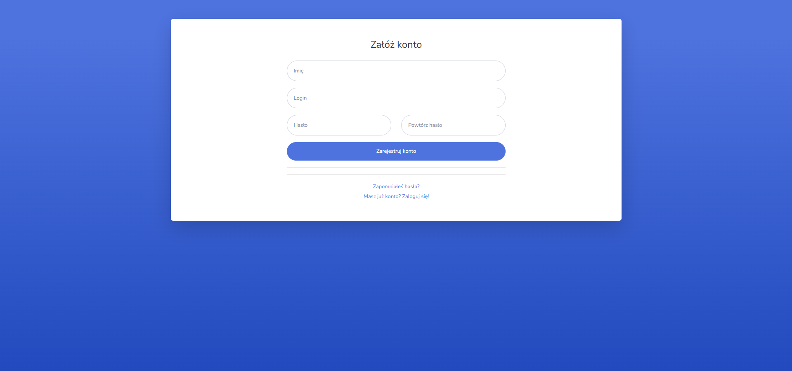
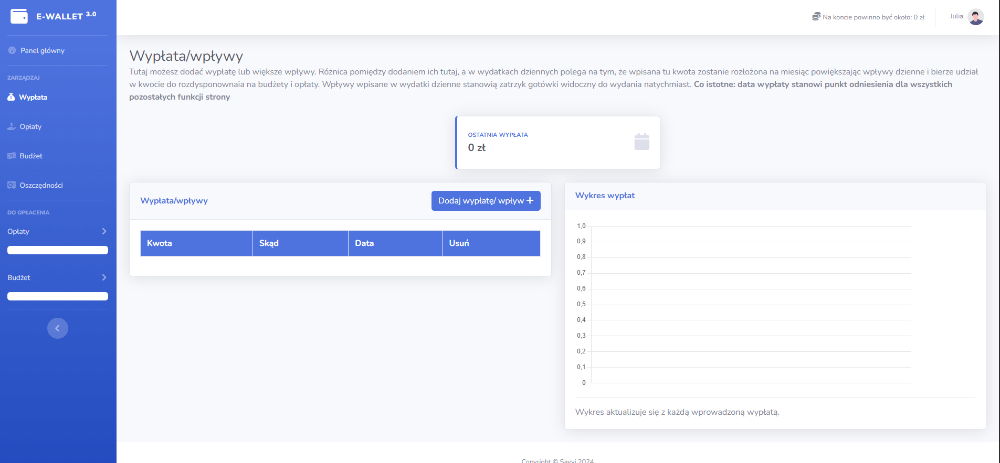
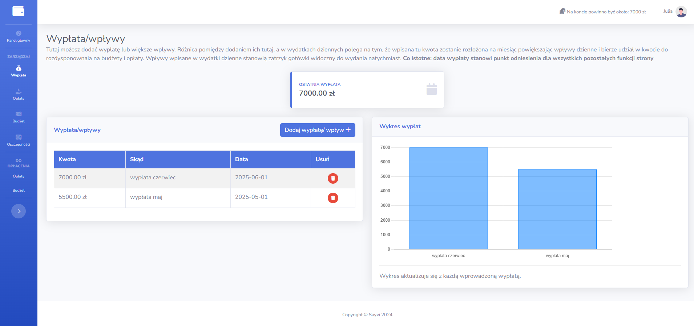
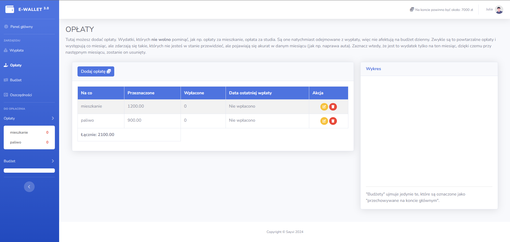
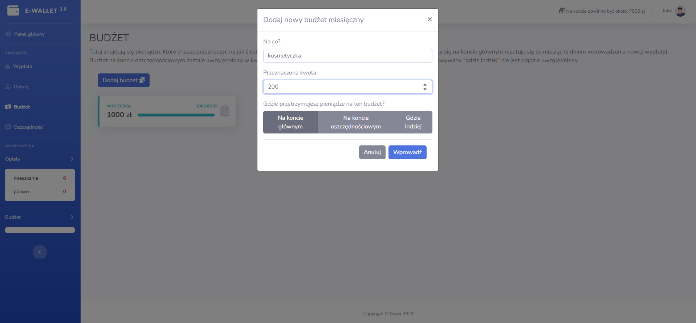
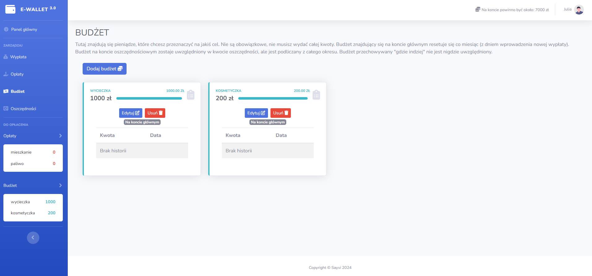
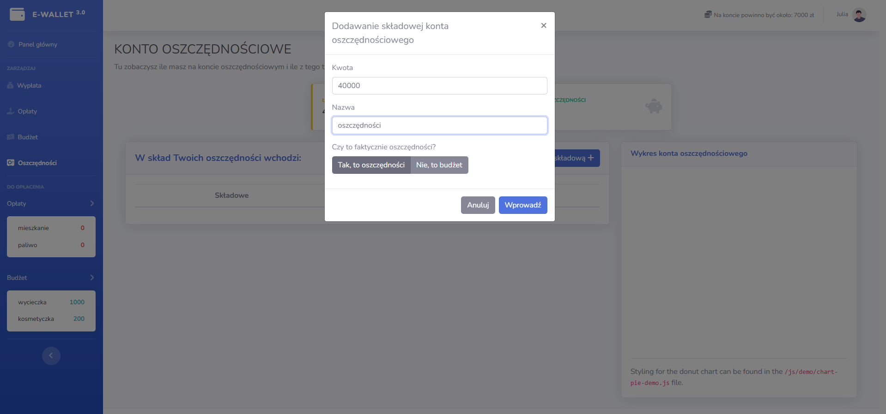
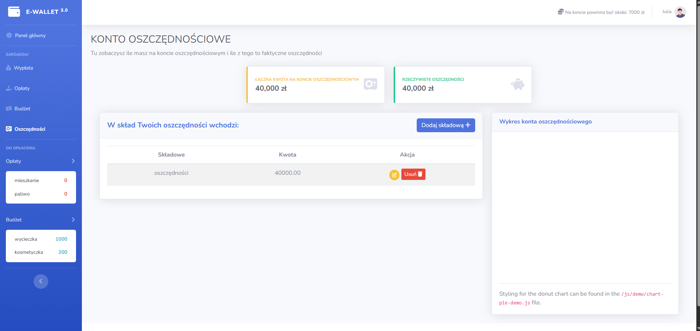
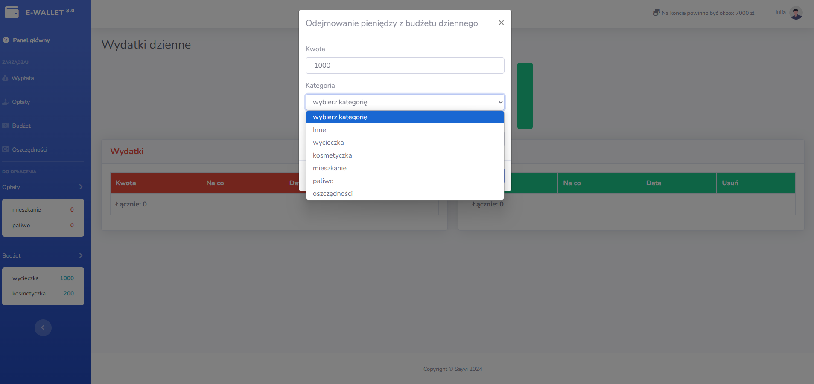
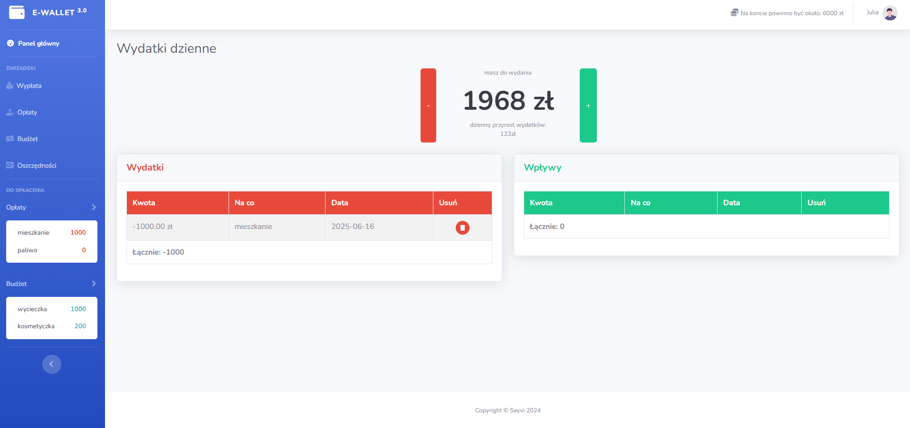
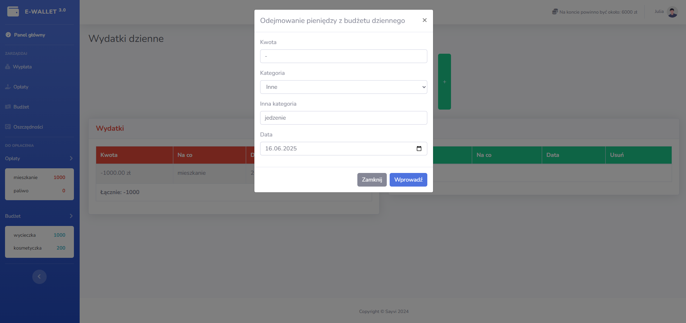
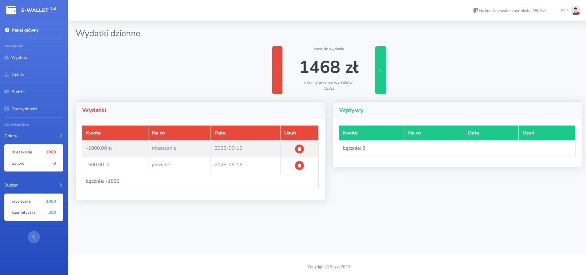
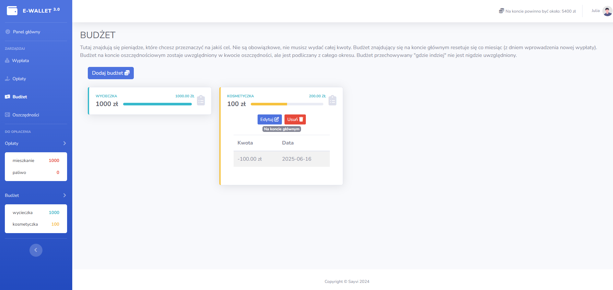
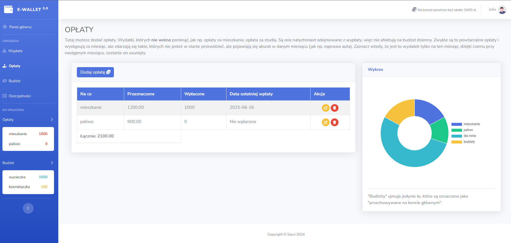